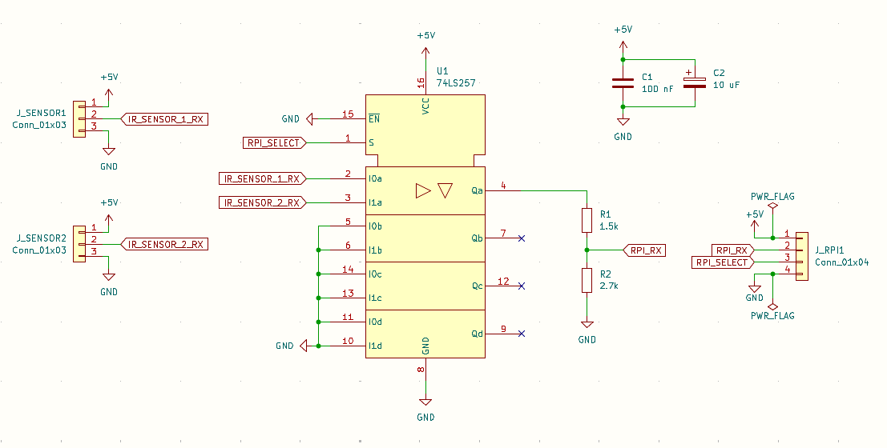

# MyElectricityMonitor

My electricity monitor using two eBZ DD3 electricity meters and one HM-600 solar inverter.

# Hardware

Electricity meter:
2 x eBZ DD3             (interface IR-UART)

Solar inverter:
1 x Hoymiles HM-600     (interface radio nRF24L01+)

## Switch for two electricity meters

This is the signal switch used two connect two electricity meters to one Raspberry PI **UART**.



## Electricity meter Raspberry PI pin connections

| RPI Pin | RPI Signal           | IR-Sensor (Switch)    |
| ------- | -------------------- | --------------------- |
| 2       | +5V                  | +5V                   |
| 6       | GND                  | GND                   |
| 10      | RXD, GPIO 15 (Input) | RX (Output)           |
| 11      | GPIO 17 (Output)     | Switch Select (Input) |

GPIO 17 is used to switch between two electricity meters.

## Solar inverter nRF24L01+ Raspberry PI pin connections

| RPI Pin | RPI Signal              | nRF24 Pin | nRF24 Signal |
| ------- | ----------------------- | --------- | ------------ |
| 17      | +3.3V                   | 2         | +3.3V        |
| 18      | GPIO 24 (Output)        | 3         | CE (Input)   |
| 19      | MOSI, GPIO 10 (Output)  | 6         | MOSI         |
| 20      | GND                     | 1         | GND          |
| 21      | MISO, GPIO 9 (Input)    | 7         | MISO         |
| (22)    | GPIO 25 (Input)         | (8)       | IRQ          |
| 23      | SCLK, GPIO 11 (Output)  | 5         | SCLK         |
| 24      | CS0, GPIO 8 (Output)    | 4         | CSN          |

Connection from Raspberry PI pin 22 to nRF24L01+ IRQ pin 8 is not necessary!
nRF24L01+ CE pin 3 can be connected to an other Raspberry PI GPIO pin.

# Software

## Rapsberry PI enable UART for electricity meters

sudo raspi-config

"Interface Options" -> "Serial Port"

"Would you like a login shell to be accessible over serial?" -> "NO"

"Would you like the serial port hardware to be enabled?" -> "YES"

## Raspberry PI enable SPI for nRF24L01+

sudo raspi-config

"Interface Options" -> "SPI"

"Would you like the SPI interface to be enabled?" -> "YES"

## Raspberry PI Python GPIO module: gpiozero

sudo python3 -m pip install gpiozero

## Raspebrry PI Python module for nRF24L01+: pyrf24

This Python code needs the pyrf24 module for communication. Install the module with the following line:

python3 -m pip install pyrf24

(see https://github.com/nRF24/pyRF24)

## Raspberry PI Python GPIO module: pyserial

python3 -m pip install pyserial

## Start the application automatically after boot: CRON job

## Application configuration

The application needs a configuration file with the following settings:

```json
{
    "Location":
    {
        "City": "Freiberg",
        "Region": "Germany",
        "Timezone": "Europe/Berlin",
        "Latitude": 50.92,
        "Longitude": 13.33
    },
    "Inverter":
    {
        "SerialNumber": "1141xxxxxxxx",
        "NumberOfChannels": 2
    },
    "Database":
    {
        "Filepath": "/home/data/Database/electricity_monitor_readings.db",
        "DataAcquisitionPeriod": 30
    }
}
```

- Location: the location to computer dawn and dusk time
- Inverter: settings to query the inverter data
- Database/Filepath: where to store the sqlite database
- Database/DataAcquisitionPeriod period of data acquisition and storage in seconds

# Information and meter readings

## eBZ DD3 meter readings

**Attention:** extended electricity meter information must be activated!
Set **Info: on** in the electricity meter settings.

+A: Active energy, grid supplies to customer.
-A: Active energy, customer supplies to grid

| Data type         | Name                           | Comment                                       |
|-------------------|--------------------------------|-----------------------------------------------|
| 81 81 C7 82 03 FF | manufacturer ID                | Manufacturer ID and device type with software version, e.g. /EBZ5DD3BZ06ETA_107 |
| 01 00 00 00 09 FF | device type                    | according to DIN 43863-5, e.g. 1EBZ0100000024 |
| 01 00 01 08 00 FF | meter reading +A, tariff-free  | unit/resolution 10 μW*h                       |
| 01 00 01 08 01 FF | meter reading +A, tariff 1     | unit/resolution 10 μW*h                       |
| 01 00 01 08 02 FF | meter reading +A, tariff 2     | unit/resolution 10 μW*h                       |
| 01 00 02 08 00 FF | meter reading -A, tariff-free  | unit/resolution 10 μW*h                       |
| 01 00 10 07 00 FF | Sum of instantaneous power in all phases | unit/resolution 0,01W               |
| 01 00 24 07 00 FF | Instantaneous power phase L1   | unit/resolution 0,01W                         |
| 01 00 38 07 00 FF | Instantaneous power phase L2   | unit/resolution 0,01W                         |
| 01 00 4C 07 00 FF | Instantaneous power phase L3   | unit/resolution 0,01W                         |

# Visualization with Grafana


